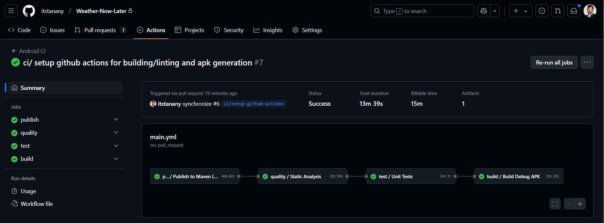

# Weather Now & Later

A modern Android weather application showcasing clean architecture and best practices in Android development.

<p align="center">
  
  &nbsp; &nbsp; &nbsp; &nbsp; &nbsp; &nbsp; &nbsp; &nbsp; &nbsp; &nbsp; &nbsp; &nbsp;
  
</p>


## Features
- Current weather conditions
- 7-day weather forecast
- City search functionality
- Last searched city persistence
- Dark Mode Support

## Modularization

| **Module**              | **Depends On**                              | **Purpose**                                                                 |
|--------------------------|---------------------------------------------|-----------------------------------------------------------------------------|
| **`app`**               | `features`, `domain`, `data`, `core`, `weather-utils`, `:features:city-input`, `:features:current-weather`, `:features:forecast`, `:features:no-internet`, `:features:splash` | Main entry point. Wires modules together, handles DI, navigation, and app lifecycle. |
| **`core`**              |  `domain`                                   | Provides shared utilities (e.g., `NetworkUtils`)|
| **`domain`**            | None                                        | Contains business logic, use cases, and repository interfaces.              |
| **`data`**              | `domain`, `core`                            | Implements repository interfaces, handles local (DataStore) and remote (Retrofit) data sources. |
| **`weather-utils`**     | None                                        | Contains reusable weather-specific utilities (e.g., formatting, conversions). |
| **`features:city-input`** | `domain`, `core`, `weather-utils`         | Manages the city input screen. Implements UI and ViewModel logic (MVVM).    |
| **`features:current-weather`** | `domain`, `core`, `weather-utils`    | Displays current weather data. Implements UI and ViewModel logic (MVVM).    |
| **`features:forecast`** | `domain`, `core`, `weather-utils`           | Displays 7-day forecast. Implements UI and ViewModel logic (MVI).    |
| **`features:no-internet`** | None                                     | Display Error Screen with retry action.                          |
| **`features:splash`** | `domain`,                                     | Splash Screen to either to city input or current weather screen. Implements UI and ViewModel logic (MVI).    |


## Architecture

### Clean Architecture
- **Domain Layer**: Business logic and entities(Use case - repository Interface, domain entity)
- **Data Layer**: Repositories implementation and data sources (local and remote)
- **Presentation Layer**: MVVM and MVI presentation architecture patterns (Uni Directional Data Flow)

| Architecture Pattern | Key Benefits | Why Used |
|---------------------|--------------|-----------|
| MVVM | - Clear separation of concerns<br>- Lifecycle-aware components<br>- Easy unit testing<br>| - Enables isolated testing of ViewModels<br>- Handles Android lifecycle automatically<br>- Provides clean data flow patterns<br>- Works well with Kotlin coroutines |
| MVI | - Immutable state management<br>- Single source of truth<br>- Predictable data flow<br>- Clear user intent handling<br>- Better debugging | - Prevents state inconsistencies<br>- Makes testing more reliable<br>- Simplifies state management<br>- Improves error tracking |


### Object-Oriented Programming Implementation

The project implements core OOP principles through a clean and maintainable architecture:

#### Encapsulation
- ViewModels encapsulate UI state and business logic
- Repositories encapsulate data operations and transformations
- Custom mappers handle data conversion between layers
- Private properties and methods control access to internal state

#### Abstraction
- Interfaces define contracts between layers (NetworkConfig, WeatherRepository)
- Abstract base classes provide common functionality (BaseUseCase)
- Use cases abstract business logic implementation details

#### Inheritance
- ViewModels inherit from Android ViewModel class.
- Base classes like BaseUseCase are reused across multiple use cases in the domain module.
This allows shared logic (e.g., coroutine dispatching) to be inherited and reused, reducing duplication.

#### Polymorphism
- Weather conditions implemented as sealed classes
- Dependency injection (e.g., through Dagger Hilt) allows polymorphic behavior: The domain layer depends on abstractions (e.g., WeatherRepository), while different implementations (e.g., WeatherRepositoryImpl) can be injected at runtime. This ensures flexibility and extensibility, enabling easy swapping of implementations.


### SOLID Principles Implementation

The project demonstrates adherence to SOLID principles through practical implementations:

#### Single Responsibility Principle (SRP)
- WeatherMapper handles only data mapping
- Each ViewModel manages single screen state and logic

#### Open/Closed Principle (OCP)
```kotlin
sealed class WeatherCondition {
    data class Sunny(val description: String) : WeatherCondition()
    data class Cloudy(val description: String) : WeatherCondition()
    data class Rainy(val description: String) : WeatherCondition()
}
```
Weather conditions are extensible without modifying existing code.

#### Liskov Substitution Principle (LSP)
```kotlin
interface WeatherRepository {
    suspend fun getCurrentWeather(city: City): DailyWeather
    suspend fun getForecast(city: City): List<DailyWeather>
}

class WeatherRepositoryImpl @Inject constructor(
    private val weatherRemoteDataSource: WeatherRemoteDataSource
) : WeatherRepository
```
Repository implementations can be substituted without affecting functionality.

#### Interface Segregation Principle (ISP)
```kotlin
interface NetworkConfig {
    val forecastApiBaseUrl: String
    val cityApiBaseUrl: String
}
```
Interfaces are kept focused and minimal.

#### Dependency Inversion Principle (DIP)

High-level modules depend on abstractions rather than concrete implementations.

These implementations ensure the codebase remains maintainable, testable, and scalable while reducing coupling between components.


## Weather Utils Library

A modular library providing essential weather data handling utilities.

* Published to local Maven, review [commit](https://github.com/itstanany/Weather-Now-Later/commit/50acc6c58379194bc0466faf1dae11b9f2fdeecc) of publishing implementation

### Features
- Temperature formatting and unit conversion
- Date parsing and formatting for weather data

### Integration
```gradle
implementation 'com.itstanany.weathernowandlater:weather-utils:1.0.0'
```

### Example Usage
```kotlin
// Format temperature
val temp = TemperatureUtils.formatTemperature(23.5, "°C")

// Parse dates
val date = DateUtils.parseDate("2024-01-05")

```

Built with comprehensive test coverage and clean architecture principles.


## CI/CD Pipeline

Implemented continuous integration and deployment using GitHub Actions:

<p align="center">
  
</p>

### Key Features
- Code linting 
- Unit test execution 
- App Build & Automated APK generation (debug)

### Why GitHub Actions?
- Seamless GitHub repository integration
- Zero configuration overhead
- Free tier.
- Built-in Android support

### Workflow Triggers
- On push to main branch
- On pull request creation
- Manual workflow dispatch

This automation ensures consistent code quality and reliable builds across the development lifecycle.


## Technology Stack

### UI & Design
- **Jetpack Compose**: Modern declarative UI toolkit for native Android development, chosen for its improved productivity and modern UI development approach
- **Material Theming**: Consistent and customizable design system that provides a polished user experience

### Architecture & State Management
- **ViewModel**: Lifecycle-aware state holder for managing UI data and surviving configuration changes
- **Kotlin Flows**: Reactive stream processing for handling asynchronous data sequences and UI state updates
- **Kotlin Coroutines**: Simplified asynchronous programming with improved readability and error handling

### Dependency Injection
- **Dagger Hilt**: Simplified dependency injection built on top of Dagger with compile time type safey, reducing boilerplate and improving build times

### Local Storage
- **DataStore**: Modern replacement for SharedPreferences, providing type-safe data storage with Kotlin Coroutines support

### Testing
- **MockK**: Kotlin-first mocking library that provides elegant DSL for test mocking
- **JUnit**: Industry-standard testing framework for unit testing with comprehensive assertion capabilities


## Engineering Practices

### Testing Strategy
- Comprehensive unit test coverage
- Isolated testing with mocked dependencies
- Edge case handling
- Coroutine testing utilities
- Unit and Instrumented Tests

### Code optimization
- use `inline` functions
- use `Immutable` collections with Jetpack Compose


## Build Artifacts

### GitHub Actions Build
The project's artifacts can be obtained through GitHub Actions in two ways:

### Download Latest Build
1. Go to the Actions tab in the repository
2. Select the latest successful workflow run
3. Download artifacts from the Artifacts section:
   - Debug APK

### Manual Build
To build locally:
```bash
# Debug build
./gradlew assembleDebug

# Release build
./gradlew assembleRelease

# Run tests
./gradlew test
```

The generated APKs can be found in:
- Debug: `app/build/outputs/apk/debug/`
- Release: `app/build/outputs/apk/release/`


## Further Improvement
#### The following are few to mention improvement can be added to the project but due to deadline were not implemented:
- Use `detekt` for comprehensive code smell detection and analysis
- use `ktlint` to enforce consistent code style and Kotlin best practices
- use git hooks fore pre-commit code quality checks
- Improve app startup time by building Baseline profiles
- Write more instrumented tests.
- Jetpack compose stabilization and optimization
- write more reusable UI components.

